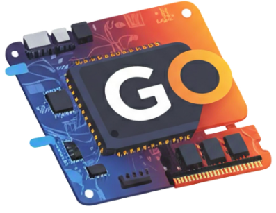

<div style="display: grid; grid-template-columns: 130px 1fr; gap: 20px; align-items: center; margin-bottom: 15px;">
  
  <div>
    <h1 style="margin: 0 0 5px 0; line-height: 1.2;">ComponentViewGO</h1>
    <p style="margin: 0; line-height: 1.4;">ComponentViewGO is an iOS application designed to assist users during custom PC assembly by utilizing on-device machine learning to identify hardware components in real-time and give installation tips/advice.</p>
  </div>
</div>

---

## App Demo

<details>
<summary><b>▶ Click here to see the demo.</b></summary>
<br />

<table align="center">
  <tr>
    <td align="center">
      <b>Main View</b><br />
      
    </td>
    <td align="center">
      <b>Contextual Tips View</b><br />
      
    </td>
  </tr>
</table>

</details>

---

## Project Status & Run Notice
**Please Note:** This repository is intended strictly as a code portfolio to showcase the application's structural architecture, MVVM design patterns, CoreML image pipelines, and development phase progression. 

* **Not Directly Runnable:** This project is **not runnable** directly out-of-the-box from this repository. 
* **Dependencies:** Running the application requires a compiled local hardware asset bundle (`.mlmodelc`), an active Apple Developer Certificate for on-device camera hardware permissions, and a locally trained Keras/MobileNetV2 neural network weight file.

---

## Architecture
* **Frontend:** SwiftUI (MVVM Architecture)
* **Frameworks:** CoreML, Vision, AVFoundation (Camera capture pipeline)
* **Machine Learning Interface:** CoreML API utilizing MobileNetV2 architecture
* **Training Pipeline Backend:** Python, TensorFlow, Keras, CoreMLTools

---

## Repository Structure

```text
ComponentViewGO/
├── ComponentViewGOApp.swift      # Main Application Entry Point
├── ContentView.swift             # Root View Router & Layout Coordinator
│
├── ViewModels/
│   └── ViewModel.swift           # Asynchronous Prediction Logic & State Management
│
├── Views/
│   └── TipsView.swift            # SwiftUI Layout displaying installation advice
│
├── UIViewRepresentables/
│   └── ImagePicker.swift         # UIKit-to-SwiftUI Bridge handling device camera streams
│
├── Models/
│   └── Picker.swift              # Hardware camera permission configurations & error management
│
├── Extensions/
│   ├── Double+Extension.swift    # Precision rounding utilities for prediction confidence
│   └── UIImage+Extension.swift   # Image resizing and CVPixelBuffer conversion pipelines
│
└── Resources/
    └── PCComponentRecognitionModel.mlmodelc/  # Compiled on-device CoreML binary bundle
